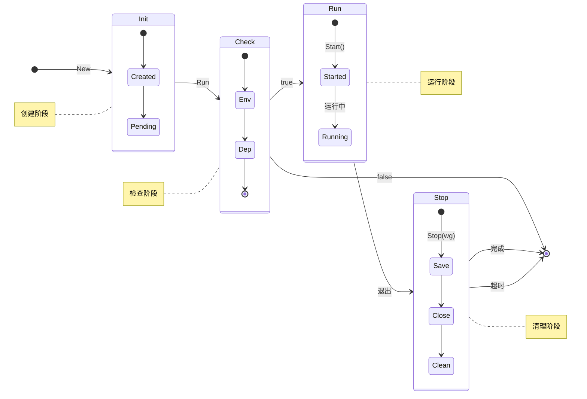

# XApp

[](https://www.nuget.org/packages/EFramework.DotNet.Utility)
[](https://deepwiki.com/eframework-io/DotNet.Utility)
[](https://discord.gg/XMPx2wXSz3)

提供了应用程序的状态管理，用于控制应用程序的启动、运行和退出流程。

## 功能特性

- 应用程序状态控制：提供 Awake、Start、Stop 等状态函数和事件
- 优雅的启动和退出：支持启动前环境检查和退出时的资源清理

## 使用手册

### 1. 生命周期
应用程序的状态转换如下：



### 2. 应用启动
应用程序需要实现 `IBase` 接口：

```csharp
public class MyApplication : XApp.IBase
{
    public bool Awake()
    {
        // 启动前检查，返回 false 将终止启动
        return true;
    }

    public void Start()
    {
        // 启动时初始化；请避免阻塞该方法
    }

    public void Stop(CountdownEvent counter)
    {
        // 退出清理；如需异步清理请调用 counter.AddCount()
        // 完成后调用 counter.Signal()
    }
}

public static class Program
{
    public static void Main(string[] args)
    {
        // 启动应用（会阻塞直至退出）
        var application = new MyApplication();
        XApp.Run(application);
    }
}
```

### 3. 应用退出
通过调用 `Quit` 函数触发应用退出：

```csharp
XApp.Quit();
```

### 4. 事件监听
内置了应用程序的状态转换事件监听：

```csharp
// 初始化事件
XApp.OnAwake += () => { };

// 启动事件
XApp.OnStart += () => { };

// 退出事件
XApp.OnStop += (counter) =>
{
    // 异步清理示例
    counter.AddCount();
    Task.Run(() =>
    {
        // 执行清理工作...
        counter.Signal();
    });
};
```

### 5. 单例访问
在任意位置通过 `Instance<T>()` 获取应用实例（未启动前为 null）：

```csharp
var instance = XApp.Instance<MyApplication>();
```

## 常见问题

更多问题，请查阅[问题反馈](../CONTRIBUTING.md#问题反馈)。

## 项目信息

- [更新记录](../CHANGELOG.md)
- [贡献指南](../CONTRIBUTING.md)
- [许可协议](../LICENSE)
