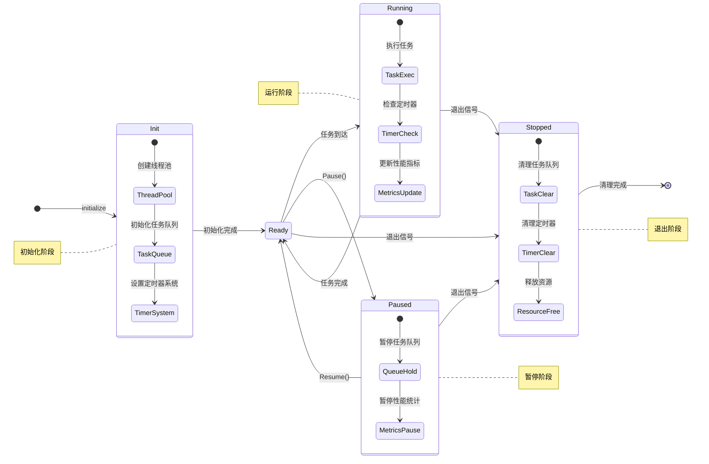

# XLoom

[](https://www.nuget.org/packages/EFramework.DotNet.Utility)
[](https://deepwiki.com/eframework-io/DotNet.Utility)
[](https://discord.gg/XMPx2wXSz3)

提供了一个轻量级的任务调度系统，用于管理异步任务、定时器和多线程并发。

## 功能特性

- 异步任务：支持执行和异常恢复异步任务
- 线程管理：支持任务管理、线程暂停/恢复控制、指标监控（FPS/QPS）
- 定时器管理：支持设置/取消超时和间歇调用

## 使用手册

### 1. 异步任务

#### 1.1 基础操作
```csharp
// 无参数异步执行
XLoom.RunAsync(() => {
    // 异步逻辑
});

// 带参数异步执行
XLoom.RunAsync((int id) => {
    // 异步逻辑
}, 1);

// 异常恢复的异步执行
XLoom.RunAsync(() => {
    // 异步逻辑
}, true);
```

### 2. 线程管理
线程调度系统运行机理如下：



#### 2.1 任务调度
```csharp
// 在指定业务线程执行任务
XLoom.RunIn(() => {
    Console.WriteLine("在业务线程 0 中执行。");
}, 0);

// 获取当前的业务线程标识
var id = XLoom.ID();

// 获取业务线程的性能指标
var fps = XLoom.FPS(0); // 业务线程 0 的帧率
var qps = XLoom.QPS(0); // 业务线程 0 的速率
```

#### 2.2 线程控制
```csharp
// 暂停/恢复单个业务线程
XLoom.Pause(0);  // 暂停业务线程 0
XLoom.Resume(0); // 恢复业务线程 0

// 暂停/恢复所有业务线程
XLoom.Pause();
XLoom.Resume();
```
#### 2.3 指标监控

支持 `Prometheus` 指标监控，可以实时监控线程的性能和资源使用情况：

| 指标 | 类型 | 描述 |
|------|------|------|
| `xloom_fps_{n}` | Gauge | 第 n 个业务线程的每秒刷新帧率 |
| `xloom_qps_{n}` | Gauge | 第 n 个业务线程的每秒处理任务数 |
| `xloom_query_total_{n}` | Counter | 第 n 个业务线程已处理的任务总数 |
| `xloom_query_total` | Counter | 所有业务线程已处理的任务总数 |

#### 2.4 可选配置

支持通过首选项配置对线程系统进行调整：

配置参数：

- `XLoom/Count`：业务线程池大小，默认为 1
- `XLoom/Step`：业务线程更新频率（毫秒），默认为 10
- `XLoom/Queue`：每个业务线程的任务队列容量，默认为 50000

配置示例：

```json
{
    "XLoom/Count": 8,
    "XLoom/Step": 10,
    "XLoom/Queue": 50000
}
```

### 3. 定时器管理

#### 3.1 超时调用
```csharp
// 延迟执行
var id = XLoom.SetTimeout(() => {
    Console.WriteLine("1 秒后执行。");
}, 1000);

// 取消超时调用
XLoom.ClearTimeout(id);
```

#### 3.2 间歇调用
```csharp
// 周期执行
var id = XLoom.SetInterval(() => {
    Console.WriteLine("间隔 1 秒执行。");
}, 1000);

// 取消间歇调用
XLoom.ClearInterval(id);
```

## 常见问题

### 1. 如何选择合适的线程数？
- 建议根据处理器数设置线程数
- 考虑任务类型和负载情况：
  - IO 密集型任务可以设置更多线程
  - CPU 密集型任务建议与处理器数相当
- 通过监控 FPS/QPS 调整线程数量
- 建议从小规模开始，根据指标监控逐步调整

### 2. 定时器精度问题？
定时器精度受以下因素影响：
- 线程更新频率：调整 Step 参数可提高精度
- 系统调度：受操作系统调度影响
- 任务队列：大量任务可能导致延迟
建议：
- 关键定时任务使用独立线程
- 避免在定时器回调中执行耗时操作

更多问题，请查阅[问题反馈](../CONTRIBUTING.md#问题反馈)。

## 项目信息

- [更新记录](../CHANGELOG.md)
- [贡献指南](../CONTRIBUTING.md)
- [许可协议](../LICENSE)
